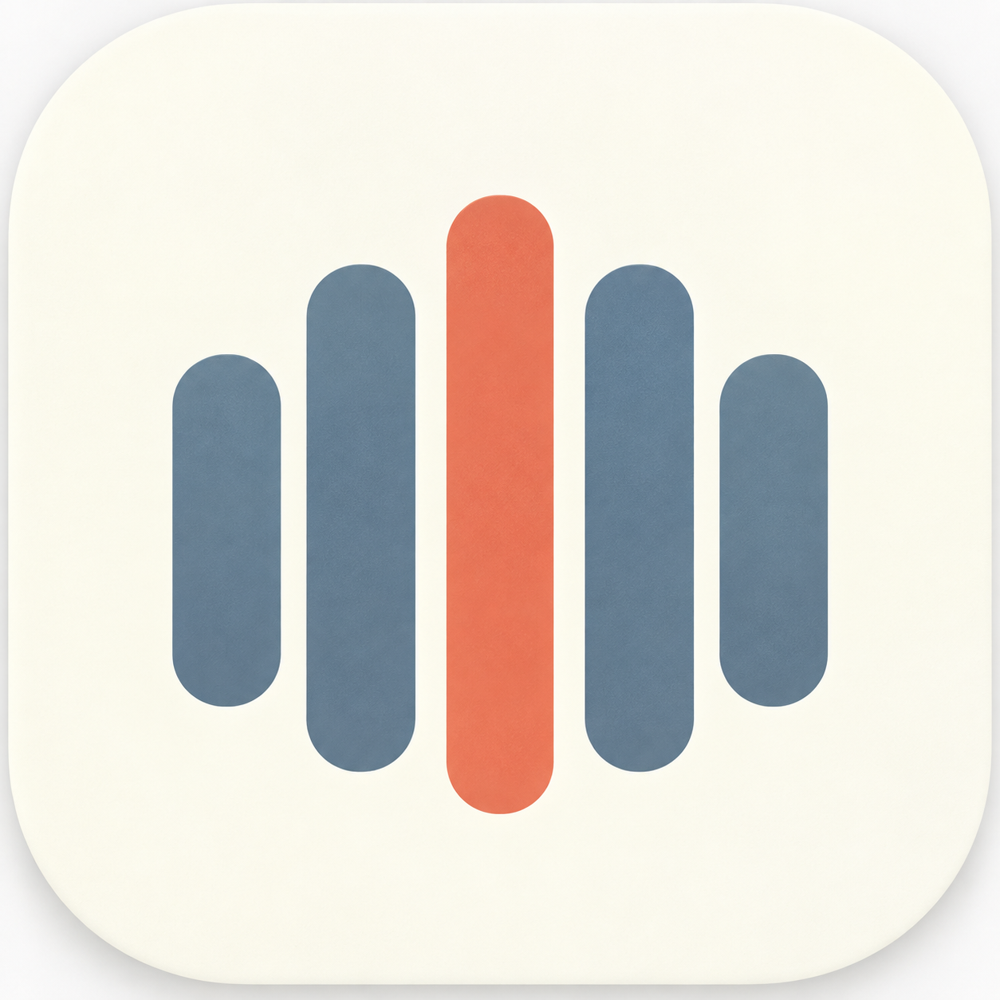

# Weeko

**基于 WakeUp 6.0.23 行为母体维护的 Android 课程表应用**

## 📖 简介

Weeko 是基于 WakeUp 6.0.23 行为母体维护的课程表项目。在保留原版课表浏览、
周次切换、上课提醒、桌面小组件、数据导入导出等核心行为的同时，
对界面与设置体验做了全面重设计。

## ✨ 特性

- **全新课程表页**：重做顶部信息区、周次浏览轨道、导航和操作入口，减少视觉干扰
- **周次切换**：优化当前周显示与切换逻辑，左右滑动浏览不同周次
- **浅色 / 深色主题**：优化两种模式下的课表背景、网格、日期、节次与课程卡片可读性
- **课程外观**：课程颜色在明暗主题下保持区分度，支持课程透明度设置
- **设置控制台**：单页设置集中管理外观、课表显示、提醒与后台、桌面与语言、数据等
- **课表管理**：直接管理课表信息、课程、作息时间、多课表和外观
- **桌面小组件**：在桌面查看课程安排
- **数据与备份**：支持导入 / 导出与备份，含首次引导和导入引导链
- **加密教务密码vault**：本地加密保存教务密码（main 分支新增）
- 

## 📸 截图

| 课程表页 | 设置页 |
|:---:|:---:|
|  |  |

<!-- TODO: 换成你的真实截图路径，或删除本区块 -->

## 📦 下载安装

前往 [Releases](https://github.com/MXWF0/Weeko/releases) 下载最新 APK。

- 当前稳定版：**v1.1.0**
- SHA-256：`a2d0e9406e0b8861d28ccf52010c7f06de6e62bb31af3afc1e2eec9a7098cf18`

## 🗂 项目结构

| 路径 | 说明 |
| --- | --- |
| `assets/` | 图标、截图等资源 |
| `docs/` | 证据与规划文档 |
| `tools/` | 工具脚本 |
| `app/` | Weeko-native 实验代码（已冻结，仅保留） |
| `adapter/wakeup/` | 手工 parser 候选（已冻结） |
| `v06-source/` | 2018 GreenDAO 工程，仅作历史对照 |

## ⚠️ 声明

Weeko 基于对 WakeUp 6.0.23 的反编译研究与重构，原应用版权归原作者所有，
本项目仅供学习与研究使用。
